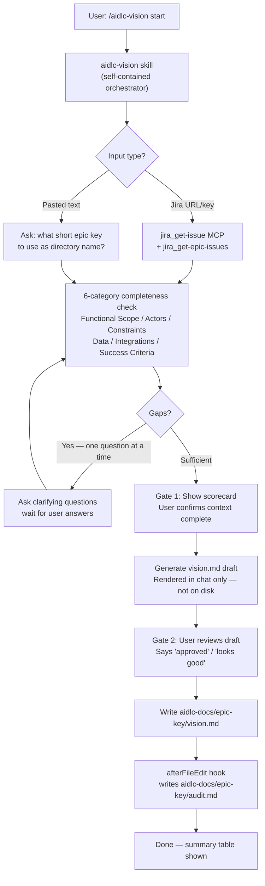

# AIDLC Vision Workflow — Phase 1

## Architecture

## What gets created (7 files)

### Skills — modular, composable

- **`.cursor/skills/aidlc-context-loader/SKILL.md`** — standalone atomic skill: accepts Jira key/URL or pasted text; calls `jira_get-issue` + `jira_get-epic-issues`; runs 6-category completeness scoring; asks one clarifying question at a time for gaps. Can be invoked independently. Mirrors `understand-me` from the draft.
- **`.cursor/skills/aidlc-vision-doc/SKILL.md`** — standalone atomic skill: takes a context block; renders `vision.md` from the included template; can be invoked independently of the orchestrator.
- **`.cursor/skills/aidlc-vision-doc/templates/vision-template.md`** — canonical template: Problem Statement, Goals, Non-Goals, Personas, Functional Scope, Out-of-Scope, Assumptions, Success Criteria, Open Questions.
- **`.cursor/skills/aidlc-vision/SKILL.md`** — **self-contained** orchestrator (all logic inline, no inter-skill calls). Activated when user says `/aidlc-vision start`. Follows the same step-by-step + approval-gate pattern as `iam-device-developer`. Trigger phrases: "approved", "looks good", "finalized".

### Rule

- **`.cursor/rules/aidlc-governance.mdc`** — `globs: aidlc-docs/**` (loads only when aidlc-docs files are open, zero cost otherwise). Governance only:
  - **DOs**: always create `audit.md` alongside docs; one epic per directory; stamp every decision with timestamp + approver.
  - **DON'Ts**: no code generation during inception phase; no overwriting `vision.md` without archiving; no skipping approval gates.

### Hook

- **`.cursor/hooks.json`** — registers `afterFileEdit` hook, matcher: `aidlc-docs/.*/vision\\.md`.
- **`.cursor/hooks/aidlc-audit-stamp.sh`** — reads edited file path from stdin JSON; extracts epic dir; appends audit entry `| <timestamp> | inception | aidlc-vision | vision.md created | pending |` to `aidlc-docs/<epic>/audit.md`. Creates `audit.md` if absent.

## Jira MCP integration

Uses the already-available `user-etools` MCP server:
- `jira_get-issue` — fetch epic details (summary, description, acceptance criteria)
- `jira_get-epic-issues` — fetch child stories to enrich context
- Tool calls are inside the orchestrator skill, not delegated to sub-skills

## Input handling

- Jira URL (`https://.../.../IAM-123`) → extract key, call MCP
- Jira key (`IAM-123`) → call MCP directly
- Pasted text → ask user for a short epic key to use as directory name; skip MCP; note "manual input" in audit
- Missing/ambiguous → prompt user, do not proceed

## Approval gates

| Gate | Trigger | Condition to pass |
|------|---------|-------------------|
| Gate 1 | After completeness check + gap-filling | User confirms context is complete |
| Gate 2 | After vision.md draft rendered in chat | User says "approved" / "looks good" / "finalized" |

Nothing is written to disk until Gate 2 is passed.

## Cost / intelligence balance

- Orchestrator skill: Sonnet-level (context analysis + structured writing)
- Sub-skills: same, on-demand only
- Hook: pure bash, zero model cost
- Rule: `globs: aidlc-docs/**` — zero cost in regular dev sessions
- No always-loaded heavy context

## Design decisions log

| Decision | Choice | Rationale |
|----------|--------|-----------|
| Inter-skill invocation | Orchestrator self-contained | Sub-skills in Cursor don't call each other reliably; `iam-device-developer` pattern |
| Dedicated agent | Dropped | Skill covers full flow; no ad-hoc use case in Phase 1 |
| Governance rule purpose | Governance only | Routing is handled by skill description triggers |
| Approval gates | Two gates | Match `iam-device-developer` pattern; nothing written until approved |
| Epic key for pasted text | Ask user explicitly | Clearest UX; avoids ugly auto-slugs |
| Audit trail author | Hook (afterFileEdit) | Clean separation; skill writes vision.md, hook writes audit.md |
| Rule activation | globs: aidlc-docs/** | Zero token cost outside aidlc sessions |
