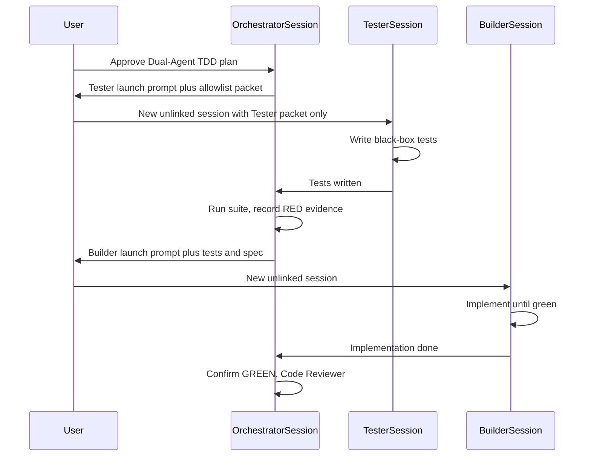

# Dual-Agent Separation (Builder vs. Tester)

**Purpose**: Single source of truth for Dual-Agent TDD. The stage rule (`construction/dual-agent-tdd.md`) and any Dual-Agent skill must follow this contract — do not duplicate or weaken it.

**Parent**: Code Generation Method **Dual-Agent TDD** (opt-in). Default Construction remains single-session TDD (`construction/tdd-code-generation.md`).

## Roles

| Role | Session | Writes | Must not |
| ---- | ------- | ------ | -------- |
| **Orchestrator** | Original AI-DLC workflow session | Packets, launch prompts, evidence files, `aidlc-docs/` summaries, audit/state | Tests or production application code |
| **Tester** | New **unlinked** agent session (not a sub-agent of the Orchestrator) | Automated tests at agreed test paths; `@spec` on tests | Read production source; read Builder packet; change production code |
| **Builder** | New **unlinked** agent session | Production application code until the Tester suite is green; `@spec` on production code | Change Tester assertions/expectations; invent tests |

**Unlinked** means a distinct agent session with no Orchestrator or Builder chat history. Task/sub-agent dispatch from the Orchestrator session is **not** an unlinked Tester or Builder — those agents inherit workspace access and parent context.



Text alternative: The user approves the plan in the Orchestrator session. The Orchestrator gives a Tester launch prompt; the user pastes it into a new session that writes tests only. The Orchestrator runs tests and records RED. The user pastes a Builder launch prompt into another new session that implements until green without editing tests. The Orchestrator confirms GREEN and runs Code Reviewer. Optional addendum repeats Tester then Builder for spec gaps.

## TDD contract (batch RED then GREEN)

Dual-Agent TDD is still TDD:

1. **RED (Tester)** — Write the full black-box suite for this unit from the spec and public contract. Compile errors and assertion failures are valid RED. Wrong-green is not.
2. **GREEN (Builder)** — Implement the smallest production change that makes that suite (and the existing suite) pass. Do not rewrite tests to match the code.
3. **Addendum (optional)** — If spec-level gaps remain after GREEN, Tester adds tests (still firewalled) → Orchestrator confirms RED → Builder greens again.

Batching the Tester suite for one unit is allowed **only** because the test author is firewalled from implementation. That exception does **not** apply to single-session TDD (`construction/tdd-code-generation.md` or `aidlc-tdd`), where horizontal slicing remains an anti-pattern.

## Tester allowlist (may read only)

- This unit's requirements: EARS files in coverage, stories, acceptance criteria
- Public contract: OpenAPI and/or AsyncAPI; otherwise `public-contract.md` produced by the Orchestrator from LLD/EARS (operations, events, DTOs — no source)
- Test framework constraints: runner, layout, naming, coverage tooling from the technical environment document or **test-tree** samples listed in the firewall manifest
- Agreed public import/module paths from the LLD or public contract (never inferred by opening `src/`)
- `tester-packet.md`, `tester-launch-prompt.md`, `firewall-manifest.md`, and (addendum only) spec-level gap lists with **no source excerpts**

## Tester denylist (must not read)

- Production source (`src/`, app/package trees, handlers, domain internals, repositories)
- `builder-packet.md`, Green/production pseudocode, NFR or infrastructure design that reveals internals
- Orchestrator or Builder chat history
- Reverse-engineering code-structure dumps of production files (test-tree excerpts in the packet are allowed when listed)

Honor-system enforcement: the launch prompt lists the allowlist and forbids search/read of denylist paths. The Orchestrator and Code Reviewer verify Tester/Builder file diffs against the manifest. There is no sandbox guarantee.

## Builder rules

- **May read**: requirements, public contract, full codebase, Tester-written tests, `builder-packet.md`, LLD/NFR as needed for implementation
- **Must not** change test assertions, expected values, or delete/skip Tester tests to obtain green
- **May** add production modules so tests compile, then pass (compile-RED is valid)
- If a test is invalid (wrong contract, impossible assertion), **stop and escalate** to the Orchestrator — do not silently edit tests
- Annotate production code with `@spec {EARS-ID}` (see `common/ears-syntax.md`); do not strip `@spec` from Tester tests

## Orchestrator rules

- Never write tests or production application code when Dual-Agent TDD is the selected method (unless the user explicitly asks the Orchestrator to patch after a failed session)
- Assemble packets **before** launching Tester; do not put Green production pseudocode in any Tester-visible file
- After Tester reports done: run the suite, write `red-evidence.md`. If new tests are already green → **firewall/test-quality failure** — do not start Builder
- After Builder reports done: run the suite, write `green-evidence.md`. On failure, return the Builder launch prompt with failure output — do not patch production in the Orchestrator session unless the user asks
- Flip EARS status markers `[ ]` → `[x]` only after `@spec`-annotated tests are green (same rule as other Code Generation methods)
- Run `construction/reviewer.md` after GREEN. Reviewer **must** flag Builder diffs that weaken, rewrite, or skip Tester tests as at least **Major** (Blocker if assertions were changed to match implementation)

## Packet schema

All Dual-Agent artifacts for a unit live under `aidlc-docs/construction/{unit-name}/dual-agent/` except the plan (see stage rule).

### `firewall-manifest.md`

```markdown
# Firewall Manifest — {unit-name}

## Tester allowlist
- [exact paths the Tester session may read]

## Tester denylist
- [production source roots and Builder-only docs]

## Test write paths
- [exact test file paths or directories the Tester may create/modify]

## Production write paths (Builder only)
- [expected production roots]
```

### `tester-packet.md`

Must include: unit name, EARS IDs and requirement text (or paths on the allowlist), public contract path, test framework constraints, test write paths, public import/module paths, behaviors to cover, out of scope. Must **not** include production pseudocode, source citations, or Builder packet content.

### `builder-packet.md`

Must include: unit name, requirements paths, public contract path, list of Tester test files (filled after RED), production write paths, LLD/NFR pointers, instruction not to edit Tester assertions.

### Launch prompts

`tester-launch-prompt.md` and `builder-launch-prompt.md` are copy-pasteable into a **new unlinked session**. Each must state: role, packet path, allowlist/denylist, write paths, stop condition (Tester: tests written and session reports done; Builder: suite green or escalation), and that the session must not open the other role's packet.

### Evidence files

`red-evidence.md` and `green-evidence.md` must record: command(s) run, exit code, relevant output (pass/fail counts), timestamp, and whether the gate passed.

### `public-contract.md`

Required when no OpenAPI/AsyncAPI exists for the unit. Orchestrator extracts public operations, events, and DTOs from LLD/EARS only. No production source.

## Addendum packet

If GREEN leaves spec-level gaps (uncovered EARS IDs, missing error paths in the contract):

1. Orchestrator writes a gap list in behavioral/contract terms — **no source excerpts, no stack traces that dump implementation**
2. Tester session (new or resumed Tester chat that still has no production source) adds tests
3. Orchestrator confirms RED
4. Builder greens the new tests without editing them

## Horizontal slicing exception

| Path | Batch all tests for a unit before implementation? |
| ---- | ------------------------------------------------- |
| Dual-Agent TDD (this file) | Yes — Tester is firewalled from implementation |
| Single-session TDD | No — one behavior Red → Green at a time |

Do not cite this exception to skip RED confirmation or to let one session write both tests and production code.
