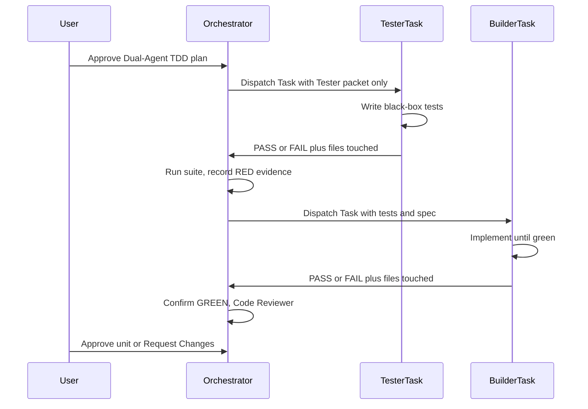

# Dual-Agent Separation (Builder vs. Tester)

**Purpose**: Single source of truth for Dual-Agent TDD. The stage rule (`construction/dual-agent-tdd.md`) and any Dual-Agent skill must follow this contract — do not duplicate or weaken it.

**Parent**: Code Generation Method **Dual-Agent TDD** (opt-in). Default Construction remains single-session TDD (`construction/tdd-code-generation.md`).

## Roles

| Role            | Session                                              | Writes                                                                 | Must not                                                              |
| --------------- | ---------------------------------------------------- | ---------------------------------------------------------------------- | --------------------------------------------------------------------- |
| **Orchestrator** | Original AI-DLC workflow session                    | Packets, Task prompts, evidence files, `aidlc-docs/` summaries, audit/state | Tests or production application code                              |
| **Tester**      | `generalPurpose` Task sub-agent (fresh context)      | Automated tests at agreed test paths; `@spec` on tests                 | Read production source; read Builder packet; change production code   |
| **Builder**     | `generalPurpose` Task sub-agent (fresh context)      | Production application code until the Tester suite is green; `@spec` on production code | Change Tester assertions/expectations; invent tests     |

Same pattern as `aidlc-tdd`: the Orchestrator **dispatches** Tester and Builder as Task sub-agents. The user does **not** open extra chats, paste prompts, or run the test suite. **Only approval gates are manual** (plan approval; RED-already-green stop; stage completion / Request Changes).

Fresh context means a new Task prompt with no Orchestrator chat history and no Builder packet in the Tester prompt. Task agents still have workspace file access — the firewall is **prompt isolation + allowlist + post-hoc audit**, not a sandbox. The Orchestrator must put allowlisted content (or allowlisted paths only) in the Tester prompt, forbid Grep/Glob/Read on denylist paths, then verify files touched.



Text alternative: The user approves the plan. The Orchestrator dispatches a Tester Task with the spec/contract packet only. After tests exist, the Orchestrator runs the suite and records RED. It then dispatches a Builder Task. After implementation, the Orchestrator records GREEN, runs Code Reviewer, and waits for the user to approve the unit. Optional addendum re-dispatches Tester then Builder for spec gaps.

## TDD contract (batch RED then GREEN)

Dual-Agent TDD is still TDD:

1. **RED (Tester)** — Write the full black-box suite for this unit from the spec and public contract. Compile errors and assertion failures are valid RED. Wrong-green is not.
2. **GREEN (Builder)** — Implement the smallest production change that makes that suite (and the existing suite) pass. Do not rewrite tests to match the code.
3. **Addendum (optional)** — If spec-level gaps remain after GREEN, dispatch Tester again (still firewalled) → Orchestrator confirms RED → dispatch Builder again.

Batching the Tester suite for one unit is allowed **only** because the test author is firewalled from implementation. That exception does **not** apply to single-session TDD (`construction/tdd-code-generation.md` or `aidlc-tdd`), where horizontal slicing remains an anti-pattern.

## Tester allowlist (may read only)

- This unit's requirements: EARS files in coverage, stories, acceptance criteria
- Public contract: OpenAPI and/or AsyncAPI; otherwise `public-contract.md` produced by the Orchestrator from LLD/EARS (operations, events, DTOs — no source)
- Test framework constraints: runner, layout, naming, coverage tooling from the technical environment document or **test-tree** samples listed in the firewall manifest
- Agreed public import/module paths from the LLD or public contract (never inferred by opening `src/`)
- `tester-packet.md`, `tester-launch-prompt.md`, `firewall-manifest.md`, and (addendum only) spec-level gap lists with **no source excerpts**

## Tester denylist (must not read)

- Production source (`src/`, app/package trees, handlers, domain internals, repositories)
- `builder-packet.md`, Green/production pseudocode, NFR or infrastructure design that reveals internals
- Orchestrator or Builder Task outputs beyond a one-line "Builder not started"
- Reverse-engineering code-structure dumps of production files (test-tree excerpts in the packet are allowed when listed)

Honor-system enforcement: the Tester Task prompt inlines or lists only allowlist paths, forbids search/read of denylist paths, and requires a **files-touched** report. The Orchestrator and Code Reviewer verify diffs against the manifest. There is no sandbox guarantee.

## Builder rules

- **May read**: requirements, public contract, full codebase, Tester-written tests, `builder-packet.md`, LLD/NFR as needed for implementation
- **Must not** change test assertions, expected values, or delete/skip Tester tests to obtain green
- **May** add production modules so tests compile, then pass (compile-RED is valid)
- If a test is invalid (wrong contract, impossible assertion), **stop and escalate** to the Orchestrator — do not silently edit tests
- Annotate production code with `@spec {EARS-ID}` (see `common/ears-syntax.md`); do not strip `@spec` from Tester tests

## Orchestrator rules

- Never write tests or production application code when Dual-Agent TDD is the selected method (unless the user explicitly asks the Orchestrator to patch after a failed Task)
- Assemble packets **before** dispatching Tester; do not put Green production pseudocode in any Tester-visible file or Tester Task prompt
- Dispatch Tester as a `generalPurpose` Task; do **not** ask the user to open a chat or paste a prompt
- After Tester returns: verify files touched vs allowlist; run the suite; write `red-evidence.md`. If new tests are already green → **firewall/test-quality failure** — stop and ask the user; do not start Builder
- Dispatch Builder as a `generalPurpose` Task (only after RED passes). After Builder returns: run the suite; write `green-evidence.md`. On failure, re-dispatch Builder with failure output (maximum 3 cycles) — do not patch production in the Orchestrator session unless the user asks
- Flip EARS status markers `[ ]` → `[x]` only after `@spec`-annotated tests are green (same rule as other Code Generation methods)
- Run `construction/reviewer.md` after GREEN. Reviewer **must** flag Builder diffs that weaken, rewrite, or skip Tester tests as at least **Major** (Blocker if assertions were changed to match implementation)

## Sub-agent dispatch rules

Match `aidlc-tdd`: every `tester` and `builder` dispatch **must** be a `generalPurpose` Task sub-agent for context isolation. Do not implement in the Orchestrator session. Do not use `explore` for Tester or Builder (those roles write files).

Each Tester prompt must include:

- Role: Tester (RED only)
- Full text or allowlisted paths of requirements, public contract, test framework constraints, test write paths
- Firewall manifest allowlist/denylist
- Instruction: do not Read, Grep, Glob, or search production source or `builder-packet.md`
- Stop condition: tests written; return PASS/FAIL, artifacts touched, test command + result, blockers

Each Builder prompt must include:

- Role: Builder (GREEN only)
- Repo root, requirements, public contract, Tester test file list, production write paths
- Instruction: do not change Tester assertions, expected values, or skip tests
- Stop condition: suite green or escalate invalid tests; return PASS/FAIL, artifacts touched, test command + result, blockers

Discover build/test commands the same way as `aidlc-tdd` (README → package.json → Makefile → language manifests → CI) and pass them in every Task prompt.

## Packet schema

All Dual-Agent artifacts for a unit live under `aidlc-docs/construction/{unit-name}/dual-agent/` except the plan (see stage rule).

### `firewall-manifest.md`

```markdown
# Firewall Manifest — {unit-name}

## Tester allowlist
- [exact paths the Tester Task may read]

## Tester denylist
- [production source roots and Builder-only docs]

## Test write paths
- [exact test file paths or directories the Tester may create/modify]

## Production write paths (Builder only)
- [expected production roots]
```

### `tester-packet.md`

Must include: unit name, EARS IDs and requirement text (or paths on the allowlist), public contract path, test framework constraints, test write paths, public import/module paths, behaviors to cover, out of scope. Must **not** include production pseudocode, source citations, or Builder packet content.

### `builder-packet.md`

Must include: unit name, requirements paths, public contract path, list of Tester test files (filled after RED), production write paths, LLD/NFR pointers, instruction not to edit Tester assertions.

### Launch prompts (Task prompt bodies)

`tester-launch-prompt.md` and `builder-launch-prompt.md` are the **Task prompt bodies** the Orchestrator passes to `generalPurpose` sub-agents. They are not user copy-paste scripts. Each must state: role, packet path, allowlist/denylist, write paths, stop condition, files-touched report, and that the Task must not open the other role's packet.

### Evidence files

`red-evidence.md` and `green-evidence.md` must record: command(s) run, exit code, relevant output (pass/fail counts), timestamp, and whether the gate passed. The **Orchestrator** runs these commands (the user does not).

### `public-contract.md`

Required when no OpenAPI/AsyncAPI exists for the unit. Orchestrator extracts public operations, events, and DTOs from LLD/EARS only. No production source.

## Addendum packet

If GREEN leaves spec-level gaps (uncovered EARS IDs, missing error paths in the contract):

1. Orchestrator writes a gap list in behavioral/contract terms — **no source excerpts, no stack traces that dump implementation**
2. Re-dispatch Tester Task with the addendum (still no production source)
3. Orchestrator confirms RED
4. Re-dispatch Builder to green the new tests without editing them

## Horizontal slicing exception

| Path                         | Batch all tests for a unit before implementation?          |
| ---------------------------- | ---------------------------------------------------------- |
| Dual-Agent TDD (this file)   | Yes — Tester is firewalled from implementation             |
| Single-session TDD           | No — one behavior Red → Green at a time                    |

Do not cite this exception to skip RED confirmation or to let the Orchestrator write both tests and production code.
