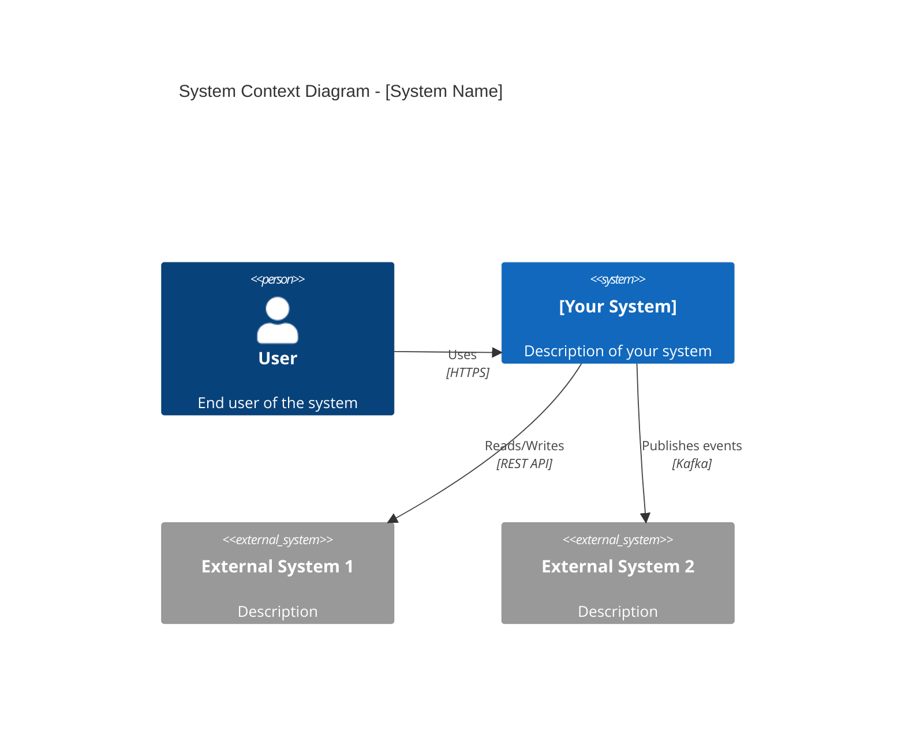
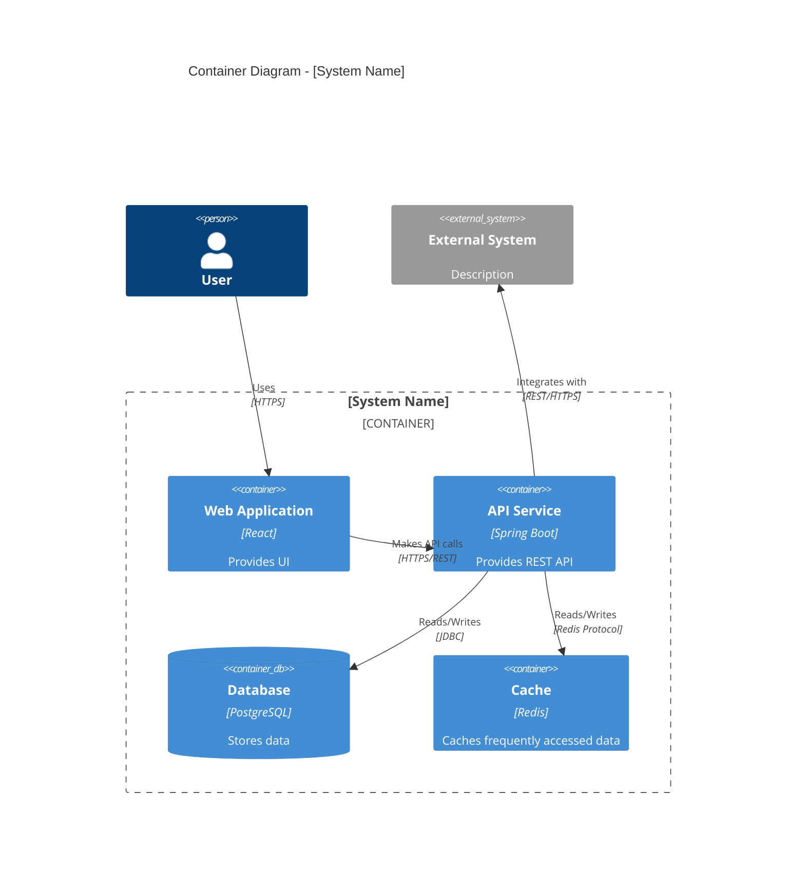
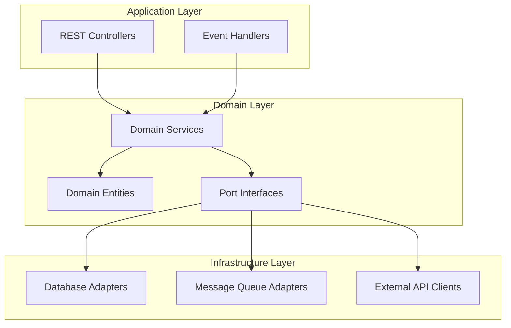
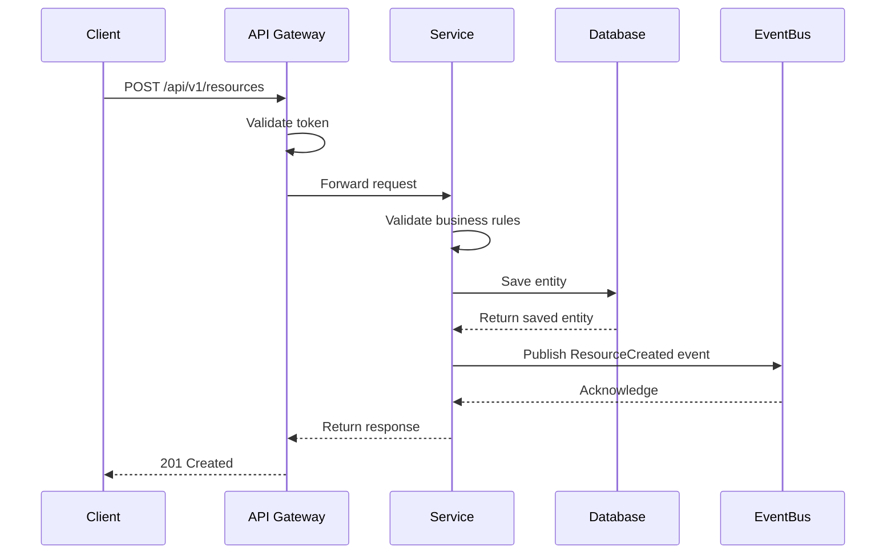
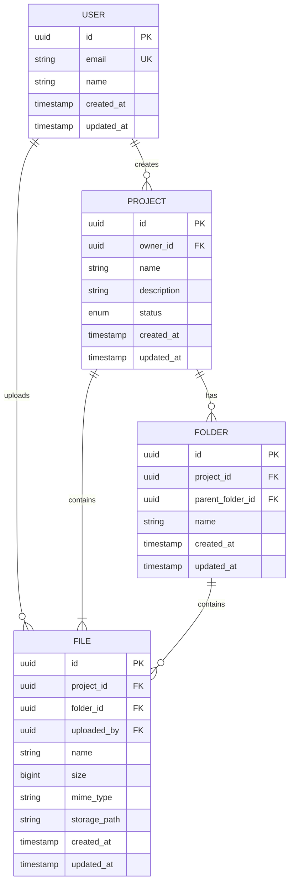
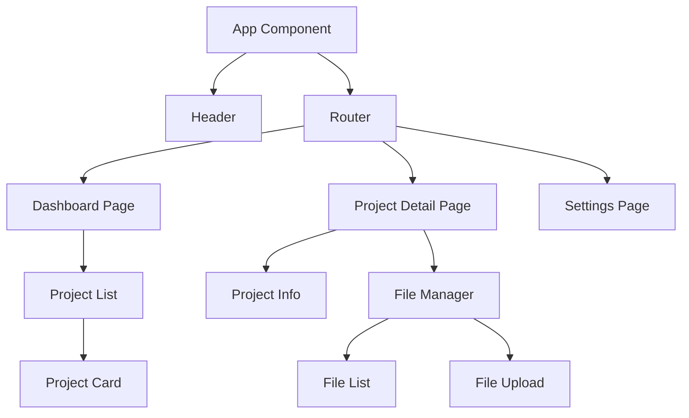
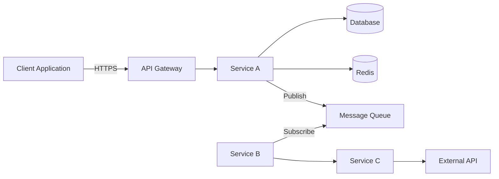

# Technical Design Document (TDD)

> **Instructions**: This template is for both frontend and backend technical designs. Remove this instruction block and any sections not applicable to your design. Replace all `[PLACEHOLDER]` text with actual content.

> **IMPORTANT - Documentation Strategy**:
> - This TDD documents **what's NEW or CHANGING** in this feature
> - For complete **current state** of the system, see `SYSTEM_ARCHITECTURE.md`
> - **Don't duplicate** entire database schema, full AWS diagram, or all existing APIs here
> - **Do include** new components, changed components, and complete reasoning/alternatives
> - After this TDD is approved and merged, update `SYSTEM_ARCHITECTURE.md` with new current state

---

## What's New or Changed in This TDD

> **Purpose**: Quick summary of what this TDD adds or modifies (remove after filling)

**New Components**:
- [ ] New database tables/changes
- [ ] New API endpoints
- [ ] New AWS resources
- [ ] New external integrations
- [ ] New event schemas

**Modified Components**:
- [ ] Database schema changes
- [ ] API modifications
- [ ] Infrastructure changes
- [ ] Existing integrations updated

**For Complete System Architecture**: See [`/docs/architecture/SYSTEM_ARCHITECTURE.md`](../SYSTEM_ARCHITECTURE.md)

---

## Document Information

> **Note**: Document ID follows the naming convention `TDD-YYYY-MM-[feature-name].md` which becomes the filename. Created and Last Updated dates are automatically tracked via Git commit history. Status is tracked through implementation progress and PR merge to main branch.

| Field | Value |
|-------|-------|
| **Author(s)** | [Name(s) and email(s)] |
| **Status** | [Not Yet Implemented / Implemented] |
| **Service/Application** | [Name of service or application] |
| **Related ADRs** | [Links to related ADR documents in `/docs/architecture/decisions/`] |
| **JIRA Ticket(s)** | [JIRA-XXX, JIRA-YYY] |
| **Review Type** | [Small Change / Large Change] |

---

## Table of Contents

1. [Executive Summary](#executive-summary)
2. [Background & Context](#background--context)
3. [Requirements](#requirements)
4. [Success Criteria](#success-criteria)
5. [Proposed Solution](#proposed-solution)
6. [Architecture & Design](#architecture--design)
7. [API Specification](#api-specification) _(Backend)_
8. [Data Modeling](#data-modeling) _(Backend)_
9. [Component Design](#component-design) _(Frontend)_
10. [System Integration](#system-integration)
11. [Infrastructure & AWS Architecture](#infrastructure--aws-architecture)
12. [Security & Compliance](#security--compliance)
13. [Performance & Scalability](#performance--scalability)
14. [Cost Estimation](#cost-estimation)
15. [Testing Strategy](#testing-strategy)
16. [Migration & Rollout Plan](#migration--rollout-plan)
17. [Monitoring & Observability](#monitoring--observability)
18. [Risks & Mitigation](#risks--mitigation)
19. [Alternatives Considered](#alternatives-considered)
20. [Open Questions](#open-questions)
21. [References](#references)

---

## Executive Summary

> **Purpose**: Provide a high-level overview (3-5 paragraphs) that can be understood by both technical and non-technical stakeholders.

**What**: [Brief description of what is being built/changed]

**Why**: [Business justification and value proposition]

**How**: [High-level approach to the solution]

**Impact**: [Expected impact on users, systems, and business metrics]

**Timeline**: [Estimated implementation timeline]

---

## Background & Context

### Current State

[Describe the current system/situation. Include diagrams if helpful.]

### Problem Statement

[Clearly articulate the problem being solved. What pain points exist? What limitations are present?]

### Business Drivers

- **Driver 1**: [Business reason]
- **Driver 2**: [Business reason]
- **Driver 3**: [Business reason]

### Stakeholders

| Stakeholder | Role | Interest/Concern |
|------------|------|------------------|
| [Name/Team] | [Role] | [What they care about] |
| [Name/Team] | [Role] | [What they care about] |

---

## Requirements

### Functional Requirements

| ID | Requirement | Priority | Notes |
|----|-------------|----------|-------|
| FR-1 | [User/system must be able to...] | High/Medium/Low | [Additional context] |
| FR-2 | [User/system must be able to...] | High/Medium/Low | [Additional context] |
| FR-3 | [User/system must be able to...] | High/Medium/Low | [Additional context] |

### Non-Functional Requirements

| Category | Requirement | Target | Measurement |
|----------|-------------|--------|-------------|
| **Performance** | API response time | < 200ms p95 | CloudWatch metrics |
| **Scalability** | Concurrent users | Support 10,000+ | Load testing |
| **Availability** | System uptime | 99.9% SLA | Monitoring dashboards |
| **Reliability** | Error rate | < 0.1% | Error tracking |
| **Maintainability** | Code coverage | > 80% | SonarQube |
| **Usability** | [If frontend] | [Target] | [Method] |

### Out of Scope

- [Item 1: What this design explicitly does NOT cover]
- [Item 2: What this design explicitly does NOT cover]
- [Item 3: Future enhancements that are not part of this iteration]

---

## Success Criteria

Define measurable criteria to determine if the implementation is successful:

| Criteria | Target | Measurement Method | Timeline |
|----------|--------|-------------------|----------|
| [Criterion 1] | [Specific target] | [How to measure] | [When to measure] |
| [Criterion 2] | [Specific target] | [How to measure] | [When to measure] |
| [Criterion 3] | [Specific target] | [How to measure] | [When to measure] |

**Acceptance Criteria**:
- [ ] [Specific condition that must be met]
- [ ] [Specific condition that must be met]
- [ ] [Specific condition that must be met]

---

## Proposed Solution

### Overview

[Provide a clear, detailed description of the proposed solution. Explain the approach at a high level.]

### Key Design Decisions

| Decision | Rationale | Trade-offs |
|----------|-----------|------------|
| [Decision 1] | [Why this choice] | [What we gain vs lose] |
| [Decision 2] | [Why this choice] | [What we gain vs lose] |
| [Decision 3] | [Why this choice] | [What we gain vs lose] |

### Technology Stack

| Component | Technology | Version | Justification |
|-----------|-----------|---------|---------------|
| **Backend Framework** | [e.g., Spring Boot] | [3.2.x] | [Why chosen] |
| **Frontend Framework** | [e.g., React] | [18.x] | [Why chosen] |
| **Database** | [e.g., PostgreSQL] | [15.x] | [Why chosen] |
| **Cache** | [e.g., Redis] | [7.x] | [Why chosen] |
| **Message Queue** | [e.g., Kafka] | [3.x] | [Why chosen] |
| **API Protocol** | [e.g., REST/GraphQL] | [Version] | [Why chosen] |

---

## Architecture & Design

### System Context (C4 Level 1)

> **Instructions**: Provide a high-level C4 Context diagram showing the system in the context of users and external systems. Keep this diagram focused on the business context and key external dependencies.

**Key Elements to Include**:
- Primary actors (users, external systems)
- Your system and its core purpose
- Critical external system dependencies
- High-level interaction patterns



**Context Description**:
[Provide a brief narrative explaining the system's role in the broader ecosystem, key user personas, and critical external dependencies]

### Container Diagram (C4 Level 2)

> **Instructions**: Show the high-level technology choices and how containers communicate. Organize containers logically by grouping related components.

**Key Elements to Include**:
- All application containers (web apps, APIs, workers)
- Data stores (databases, caches, object storage)
- Message queues and event buses
- Key external systems
- Communication protocols and patterns



**Container Responsibilities**:
- **[Container 1]**: [Clear description of responsibilities and key capabilities]
- **[Container 2]**: [Clear description of responsibilities and key capabilities]
- **[Data Store]**: [Schema, access patterns, scaling strategy]

### Component Architecture

> **Instructions**: For backend services using hexagonal architecture, describe the component structure.



**Component Descriptions**:

- **API Layer**: [Description of controllers, input validation, DTOs]
- **Domain Layer**: [Core business logic, domain models, service orchestration]
- **Infrastructure Layer**: [Data persistence, external integrations, technical implementations]

---

## API Specification

> **Instructions**: Applicable for backend services.
>
> **IMPORTANT**: 
> - The complete API specification MUST be provided in **OpenAPI YAML format** (see OpenAPI Specification section below)
> - This section documents **business logic, edge cases, and error scenarios** for each API
> - Both are required: OpenAPI YAML for the contract + detailed business logic documentation

### Base URL

```
Development: https://api-dev.connect.trimble.com/v1
Stage: https://api-stage.connect.trimble.com/v1
Production: https://api.connect.trimble.com/v1
```

### Authentication

**Method**: Trimble Identity (TID) - OAuth 2.0 Bearer Token

> **Note**: All Trimble Connect services MUST use Trimble Identity (TID) for authentication.

**Headers**:
```
Authorization: Bearer {tid-token}
X-Trimble-User-Id: {user-id}
```

### OpenAPI Specification

**Location**: `/docs/api/openapi.yaml`

**Sample OpenAPI Structure**:
```yaml
openapi: 3.0.3
info:
  title: [Service Name] API
  version: 1.0.0
  description: [API description]
servers:
  - url: https://api.connect.trimble.com/v1
    description: Production
  - url: https://api-stage.connect.trimble.com/v1
    description: Staging
paths:
  /resources:
    post:
      summary: Create a new resource
      operationId: createResource
      tags:
        - Resources
      security:
        - BearerAuth: []
      requestBody:
        required: true
        content:
          application/json:
            schema:
              $ref: '#/components/schemas/CreateResourceRequest'
      responses:
        '201':
          description: Resource created successfully
          content:
            application/json:
              schema:
                $ref: '#/components/schemas/Resource'
        '400':
          $ref: '#/components/responses/BadRequest'
        '401':
          $ref: '#/components/responses/Unauthorized'
components:
  schemas:
    CreateResourceRequest:
      type: object
      required:
        - name
      properties:
        name:
          type: string
          maxLength: 255
    Resource:
      type: object
      properties:
        id:
          type: string
          format: uuid
        name:
          type: string
  securitySchemes:
    BearerAuth:
      type: http
      scheme: bearer
      bearerFormat: JWT
```

**MUST-HAVES in OpenAPI Spec**:
- All request/response schemas
- All status codes
- Request validation rules
- Security requirements
- Rate limiting policies

---

### API Endpoints (Business Logic Documentation)

#### 1. [Endpoint Name]

**Purpose**: [What this endpoint does]

**Method**: `POST`

**Path**: `/api/v1/resources`

**Request Headers**:
```
Content-Type: application/json
Authorization: Bearer {token}
```

**Request Body**:
```json
{
  "field1": "string",
  "field2": 123,
  "field3": {
    "nestedField": "value"
  },
  "field4": ["item1", "item2"]
}
```

**Request Body Schema**:

| Field | Type | Required | Validation | Description |
|-------|------|----------|------------|-------------|
| `field1` | string | Yes | Max 255 chars | [Description] |
| `field2` | integer | Yes | Min: 1, Max: 1000 | [Description] |
| `field3` | object | No | - | [Description] |
| `field3.nestedField` | string | No | - | [Description] |
| `field4` | array[string] | No | Max 10 items | [Description] |

**Response (200 OK)**:
```json
{
  "id": "uuid",
  "field1": "string",
  "field2": 123,
  "createdAt": "2026-01-30T10:00:00Z",
  "status": "active"
}
```

**Response Schema**:

| Field | Type | Description |
|-------|------|-------------|
| `id` | string (UUID) | Unique identifier |
| `field1` | string | [Description] |
| `field2` | integer | [Description] |
| `createdAt` | string (ISO 8601) | Creation timestamp |
| `status` | enum | Values: active, inactive, pending |

**Error Responses**:

| Status Code | Scenario | Response Body |
|------------|----------|---------------|
| 400 | Invalid request | `{"error": "BAD_REQUEST", "message": "Invalid field1", "details": [...]}` |
| 401 | Unauthorized | `{"error": "UNAUTHORIZED", "message": "Invalid or expired token"}` |
| 403 | Forbidden | `{"error": "FORBIDDEN", "message": "Insufficient permissions"}` |
| 404 | Not found | `{"error": "NOT_FOUND", "message": "Resource not found"}` |
| 429 | Rate limit | `{"error": "RATE_LIMIT_EXCEEDED", "message": "Too many requests"}` |
| 500 | Server error | `{"error": "INTERNAL_SERVER_ERROR", "message": "An error occurred"}` |

**Rate Limiting**: [e.g., 100 requests per minute per user]

**Example Request**:
```bash
curl -X POST https://api.connect.trimble.com/v1/resources \
  -H "Content-Type: application/json" \
  -H "Authorization: Bearer {token}" \
  -d '{
    "field1": "example",
    "field2": 42
  }'
```

**Business Logic**:

1. Validate incoming request payload
2. Check user permissions for the requested resource
3. [Step-by-step description of what the API does]
4. Perform data validation and business rule checks
5. Save to database within a transaction
6. Publish event to event bus (if applicable)
7. Return response

**Edge Cases & Error Handling**:

- **Case 1**: [Describe edge case and how it's handled]
- **Case 2**: [Describe edge case and how it's handled]
- **Case 3**: [Describe edge case and how it's handled]

---

#### 2. [Additional Endpoints]

[Repeat the above structure for each endpoint]

---

### API Sequence Diagram



### API Versioning Strategy

[Describe how API versions are managed, backward compatibility approach, deprecation policy]

---

## Data Modeling

> **Instructions**: Applicable for backend services. Document database schema, query patterns, and indexing strategy.

> **IMPORTANT - Show Delta, Not Full Schema**:
> - Document **NEW tables** and **MODIFIED tables** only
> - For complete current schema, see `SYSTEM_ARCHITECTURE.md`
> - Include **before/after** diagrams if modifying existing schema
> - Document **all new query patterns** and map to APIs

### Database Technology

**Type**: [PostgreSQL / MongoDB / DynamoDB / etc.]

**Justification**: [Why this database was chosen]

### Entity Relationship Diagram



### Schema Details

#### Table: `users`

**Purpose**: [Description of what this table stores]

| Column | Type | Constraints | Description |
|--------|------|-------------|-------------|
| `id` | UUID | PRIMARY KEY | Unique identifier |
| `email` | VARCHAR(255) | NOT NULL, UNIQUE | User email address |
| `name` | VARCHAR(255) | NOT NULL | User full name |
| `created_at` | TIMESTAMP | NOT NULL, DEFAULT NOW() | Record creation time |
| `updated_at` | TIMESTAMP | NOT NULL, DEFAULT NOW() | Last update time |

**Indexes**:

| Index Name | Type | Columns | Purpose |
|-----------|------|---------|---------|
| `idx_users_email` | UNIQUE | email | Fast lookup by email |
| `idx_users_created_at` | BTREE | created_at | Range queries on creation date |

---

#### Table: `projects`

**Purpose**: [Description of what this table stores]

| Column | Type | Constraints | Description |
|--------|------|-------------|-------------|
| `id` | UUID | PRIMARY KEY | Unique identifier |
| `owner_id` | UUID | NOT NULL, FK -> users(id) | Project owner |
| `name` | VARCHAR(255) | NOT NULL | Project name |
| `description` | TEXT | NULL | Project description |
| `status` | ENUM | NOT NULL, DEFAULT 'active' | Values: active, archived, deleted |
| `created_at` | TIMESTAMP | NOT NULL, DEFAULT NOW() | Record creation time |
| `updated_at` | TIMESTAMP | NOT NULL, DEFAULT NOW() | Last update time |

**Indexes**:

| Index Name | Type | Columns | Purpose |
|-----------|------|---------|---------|
| `idx_projects_owner` | BTREE | owner_id | Query projects by owner |
| `idx_projects_status` | BTREE | status | Filter by status |
| `idx_projects_owner_status` | COMPOSITE | owner_id, status | Combined query optimization |

**Foreign Keys**:
- `owner_id` REFERENCES `users(id)` ON DELETE CASCADE

---

### Query Patterns

> **IMPORTANT**: Document ALL database access patterns and map them to the APIs/use cases where they are used.

Document the most common query patterns and how they're optimized:

#### Query Pattern 1: Get User's Active Projects

**Use Case**: [When this query is used]

**Used By**: 
- API: `GET /api/v1/projects` (list user projects)
- Use Case: Dashboard page load, project selection dropdown

**SQL**:
```sql
SELECT p.id, p.name, p.description, p.created_at
FROM projects p
WHERE p.owner_id = :userId
  AND p.status = 'active'
ORDER BY p.created_at DESC
LIMIT 50;
```

**Frequency**: [e.g., High - called on every dashboard load]

**Expected Performance**: [e.g., < 10ms for 1000 projects]

**Index Used**: `idx_projects_owner_status`

**Optimization Notes**: [Any specific optimization techniques]

---

#### Query Pattern 2: [Additional Query Pattern]

**Use Case**: [When this query is used]

**Used By**:
- API: [Which API endpoint uses this]
- Use Case: [Which user action or background job triggers this]

[Repeat for each major query pattern]

---

### Query Pattern to API Mapping

| Query Pattern | API Endpoint(s) | Use Case | Frequency | Performance Target |
|--------------|----------------|----------|-----------|-------------------|
| Get User's Active Projects | `GET /projects` | Dashboard load | High | < 10ms |
| [Pattern 2] | [Endpoint] | [Use case] | [Frequency] | [Target] |
| [Pattern 3] | [Endpoint] | [Use case] | [Frequency] | [Target] |

---

### Data Access Patterns (NoSQL)

> **Instructions**: For NoSQL databases (DynamoDB, MongoDB, etc.), document access patterns instead of SQL queries.

#### Access Pattern 1: [Pattern Name]

**Use Case**: [Scenario where this pattern is used]

**Partition Key**: [PK design]

**Sort Key**: [SK design]

**Example Key Structure**:
```
PK: USER#<userId>
SK: PROJECT#<projectId>
```

**Query Example**:
```
Query where PK = USER#123
```

**GSI Required**: [Yes/No - describe if yes]

**Expected Item Count**: [Approximate items returned]

**Read/Write Units**: [Estimated RCU/WCU]

---

### Data Migration Strategy

**Migration Type**: [Zero-downtime / Scheduled downtime / Phased rollout]

**Steps**:
1. [Migration step 1]
2. [Migration step 2]
3. [Migration step 3]

**Rollback Plan**: [How to roll back if migration fails]

**Data Validation**: [How to validate data integrity post-migration]

---

### Data Retention & Archival

**Retention Policy**: [e.g., Keep data for 7 years]

**Archival Strategy**: [e.g., Move to S3 Glacier after 1 year]

**Deletion Policy**: [e.g., Soft delete with 30-day grace period]

---

## Component Design

> **Instructions**: Applicable for frontend applications. Document component architecture, state management, and UI design.

### Frontend Architecture

**Framework**: [React / Angular / Vue / etc.]

**Architecture Pattern**: [e.g., Container/Presentational, Feature-based, Atomic Design]

### Component Hierarchy



### Component Specifications

#### Component: `ProjectCard`

**Purpose**: [Display project summary in a card format]

**Props**:

| Prop | Type | Required | Default | Description |
|------|------|----------|---------|-------------|
| `project` | Project | Yes | - | Project data object |
| `onSelect` | function | Yes | - | Callback when card is clicked |
| `showActions` | boolean | No | true | Show/hide action buttons |

**State**: [Describe internal state, if any]

**Events Emitted**:
- `onSelect(projectId)`: When user clicks on the card
- `onEdit(projectId)`: When user clicks edit button
- `onDelete(projectId)`: When user clicks delete button

**Example Usage**:
```jsx
<ProjectCard
  project={projectData}
  onSelect={handleProjectSelect}
  showActions={true}
/>
```

**UI Mockup**: [Link to Figma/design tool, or include screenshot]

---

### State Management

**Library**: [Redux / Zustand / Context API / Recoil]

**State Structure**:
```typescript
interface AppState {
  user: {
    profile: UserProfile | null;
    isAuthenticated: boolean;
  };
  projects: {
    list: Project[];
    selected: Project | null;
    loading: boolean;
    error: string | null;
  };
  ui: {
    sidebarOpen: boolean;
    theme: 'light' | 'dark';
  };
}
```

**Actions/Mutations**:
- `fetchProjects()`: Fetch user's projects
- `selectProject(id)`: Set selected project
- `createProject(data)`: Create new project
- `updateProject(id, data)`: Update existing project
- `deleteProject(id)`: Delete project

---

### Routing

**Routes**:

| Path | Component | Auth Required | Description |
|------|-----------|---------------|-------------|
| `/` | Dashboard | Yes | User dashboard |
| `/projects/:id` | ProjectDetail | Yes | Project details page |
| `/settings` | Settings | Yes | User settings |
| `/login` | Login | No | Login page |
| `/404` | NotFound | No | 404 error page |

---

### API Integration (Frontend)

> **IMPORTANT**: Document which backend APIs are invoked with complete details including query parameters, pagination, request/response structure, and error handling.

**HTTP Client**: [Axios / Fetch API / etc.]

**Base URL Configuration**:
```typescript
const API_BASE_URL = process.env.REACT_APP_API_URL;
```

**API Call Documentation**:

#### API Call 1: Fetch Projects

**Backend API**: `GET /api/v1/projects`

**Query Parameters**:
- `status` (optional): Filter by status (active, archived)
- `page` (optional): Page number (default: 1)
- `pageSize` (optional): Items per page (default: 20, max: 100)
- `sortBy` (optional): Sort field (createdAt, name)
- `sortOrder` (optional): Sort order (asc, desc)

**Pagination**: Yes, cursor-based / offset-based
- **Page Size**: 20 items per page (configurable up to 100)
- **Total Count**: Returned in response header `X-Total-Count`

**Request Headers**:
```
Authorization: Bearer {token}
X-Trimble-User-Id: {userId}
```

**Response Structure**:
```typescript
interface ProjectsResponse {
  data: Project[];
  pagination: {
    page: number;
    pageSize: number;
    totalPages: number;
    totalItems: number;
  };
}
```

**Example Implementation**:
```typescript
interface FetchProjectsParams {
  status?: 'active' | 'archived';
  page?: number;
  pageSize?: number;
  sortBy?: 'createdAt' | 'name';
  sortOrder?: 'asc' | 'desc';
}

async function fetchProjects(params: FetchProjectsParams = {}): Promise<ProjectsResponse> {
  const queryParams = new URLSearchParams({
    page: (params.page || 1).toString(),
    pageSize: (params.pageSize || 20).toString(),
    ...(params.status && { status: params.status }),
    ...(params.sortBy && { sortBy: params.sortBy }),
    ...(params.sortOrder && { sortOrder: params.sortOrder }),
  });

  const response = await axios.get(
    `${API_BASE_URL}/api/v1/projects?${queryParams}`,
    {
      headers: {
        Authorization: `Bearer ${getAuthToken()}`,
        'X-Trimble-User-Id': getUserId(),
      },
    }
  );
  
  return response.data;
}
```

**Error Handling**: 
- 401: Redirect to login
- 403: Show permission denied message
- 429: Implement exponential backoff retry
- 500: Show generic error, log to monitoring

**Loading States**: 
- Initial load: Full-page skeleton
- Pagination: Loading spinner in table footer
- Refresh: Subtle loading indicator

---

#### API Call 2: [Additional API Call]

[Repeat structure for each backend API invoked by the frontend]

---

### Frontend to Backend API Mapping

| Frontend Component/Action | Backend API | Query Params | Pagination | Page Size | Notes |
|---------------------------|-------------|--------------|------------|-----------|-------|
| Dashboard - Project List | `GET /projects` | `status=active` | Yes | 20 | Auto-refresh every 30s |
| Project Detail | `GET /projects/{id}` | None | No | N/A | Include related data |
| Create Project | `POST /projects` | None | No | N/A | Optimistic UI update |
| [Component/Action] | [Endpoint] | [Params] | [Yes/No] | [Size] | [Notes] |

**Error Handling**: [Describe how API errors are handled in the UI]

**Loading States**: [Describe loading indicators and skeleton screens]

---

### UI/UX Mockups

[Include links to Figma, Sketch, or other design tools. If not available, include screenshots or wireframes.]

**Key Screens**:
1. [Screen 1 - Description]: [Link or image]
2. [Screen 2 - Description]: [Link or image]
3. [Screen 3 - Description]: [Link or image]

---

### Accessibility

**Compliance Level**: [WCAG 2.1 Level AA]

**Key Considerations**:
- [ ] Keyboard navigation support
- [ ] Screen reader compatibility (ARIA labels)
- [ ] Color contrast ratios meet standards
- [ ] Focus indicators visible
- [ ] Form validation with clear error messages
- [ ] Alt text for all images

---

## System Integration

### Integration Architecture



### Inter-Service Communication

| Source Service | Target Service | Protocol | Purpose | Error Handling |
|---------------|----------------|----------|---------|----------------|
| Service A | Service B | REST API | [Purpose] | [Strategy] |
| Service A | Message Queue | Kafka | [Purpose] | [Strategy] |
| Service B | External API | REST API | [Purpose] | [Strategy] |

### Event-Driven Interactions

**Events Published**:

| Event Name | Schema Version | Trigger | Payload | Consumers |
|-----------|----------------|---------|---------|-----------|
| `ProjectCreated` | v1 | New project created | `{"projectId": "uuid", "ownerId": "uuid", ...}` | [Service B, Service C] |
| `FileUploaded` | v1 | File uploaded | `{"fileId": "uuid", "projectId": "uuid", ...}` | [Service D] |

**Event Schema Example** (CloudEvents format):
```json
{
  "specversion": "1.0",
  "type": "com.trimble.connect.project.created",
  "source": "/projects/service",
  "id": "A234-1234-1234",
  "time": "2026-01-30T12:00:00Z",
  "datacontenttype": "application/json",
  "data": {
    "projectId": "uuid-here",
    "ownerId": "uuid-here",
    "name": "New Project",
    "createdAt": "2026-01-30T12:00:00Z"
  }
}
```

---

### External System Integrations

> **IMPORTANT**: All external system integrations MUST implement circuit breaker patterns and retry strategies.

| System | Purpose | Protocol | Authentication | Rate Limits | Circuit Breaker | Retry Strategy |
|--------|---------|----------|----------------|-------------|-----------------|----------------|
| [External System 1] | [Purpose] | REST | OAuth 2.0 | 1000 req/min | Yes | Exponential backoff |
| [External System 2] | [Purpose] | SOAP | API Key | 500 req/min | Yes | Fixed delay |

**Circuit Breaker Configuration**:
- **Failure Threshold**: [e.g., 5 failures in 10 seconds]
- **Open State Duration**: [e.g., 30 seconds before attempting half-open]
- **Half-Open Test Calls**: [e.g., 1 test call to determine if circuit should close]
- **Success Threshold**: [e.g., 2 consecutive successes to close circuit]

**Retry Strategy**:
- **Type**: [Exponential backoff / Fixed delay / Jittered exponential backoff]
- **Max Retries**: [e.g., 3 attempts]
- **Initial Delay**: [e.g., 100ms]
- **Max Delay**: [e.g., 10 seconds]
- **Retryable Errors**: [e.g., 429, 500, 502, 503, 504, network timeouts]
- **Non-Retryable Errors**: [e.g., 400, 401, 403, 404]

**Failure Handling**:
- Timeout configuration: [e.g., 5 seconds connection, 30 seconds read]
- Fallback behavior: [e.g., Return cached data, degrade gracefully, queue for later processing]
- Dead Letter Queue: [Yes/No - for failed async operations]
- Monitoring: [Alerts on circuit breaker state changes, high failure rates]

**Example Configuration** (Resilience4j):
```yaml
resilience4j:
  circuitbreaker:
    instances:
      externalSystem1:
        failure-rate-threshold: 50
        wait-duration-in-open-state: 30s
        sliding-window-size: 10
        permitted-number-of-calls-in-half-open-state: 3
  retry:
    instances:
      externalSystem1:
        max-attempts: 3
        wait-duration: 500ms
        exponential-backoff-multiplier: 2
        retry-exceptions:
          - java.net.ConnectException
          - java.net.SocketTimeoutException
```

---

## Infrastructure & AWS Architecture

### AWS Architecture Diagram

> **⚠️ MANDATORY**: Every service must have an AWS infrastructure diagram.

> **Instructions**: Create this diagram in Lucid and export as PNG. Place in `/docs/architecture/diagrams/aws-infrastructure-[service-name]-[YYYY-MM-DD].png`

> **Networking Documentation**: For detailed networking configuration, security groups, NACLs, and routing tables, refer to the **Networking Documentation** (owned by SRE team). Link: `[SRE Networking Documentation URL]`


**Diagram MUST include**:

**Networking (High-Level - Detailed Config in SRE Documentation)**:
- ✅ VPC with CIDR block labeled (e.g., 10.0.0.0/16)
- ✅ Public subnets (indicate which resources: ALB, NAT Gateway)
- ✅ Private subnets (indicate which resources: ECS, RDS, ElastiCache)
- ✅ Availability zones (minimum 2)
- ✅ Internet Gateway
- ✅ NAT Gateway(s) (one per AZ for HA)
- ✅ VPC Endpoints (for AWS services: S3, DynamoDB, SNS, etc.)
- ✅ Security group boundaries (high-level - details in SRE docs)
- ✅ Network flow direction (public → private)

> **Note**: The diagram should show high-level network segmentation (public/private subnets, VPC endpoints). Detailed security group rules, NACLs, and route table configurations should be documented in the SRE Networking Documentation.

**Compute**:
- ECS/EKS clusters, EC2 instances, Lambda functions
- Load balancers (ALB/NLB)
- API Gateway
- Auto Scaling groups

**Data Stores**:
- RDS instances (with Multi-AZ notation)
- DynamoDB tables
- ElastiCache clusters
- S3 buckets
- Database subnet groups

**Security & Management**:
- IAM roles (annotate key roles)
- AWS Secrets Manager / Systems Manager Parameter Store
- WAF, AWS Shield (if used)
- CloudWatch (logs, metrics, alarms)
- X-Ray, CloudTrail

**Additional Components**:
- Route 53 (DNS)
- CloudFront (CDN)
- VPC peering, Transit Gateway (if used)
- VPN connections (if used)

**Best Practices for AWS Diagrams**:
- Use official AWS architecture icons from [AWS Architecture Icons](https://aws.amazon.com/architecture/icons/)
- Group resources by VPC/subnet
- Use color coding (blue for networking, orange for compute, green for data stores)
- Show data flow direction with arrows
- Include diagram date/version in the image
- Add legend for custom notation

**Storage**: Save to `/docs/architecture/diagrams/aws-infrastructure-[service-name]-[YYYY-MM-DD].png`

---

### Infrastructure Components

| Component | AWS Service | Configuration | Purpose |
|-----------|-------------|---------------|---------|
| **Compute** | ECS Fargate | 2 vCPU, 4GB RAM | Run containerized services |
| **Load Balancer** | ALB | Internet-facing | Route traffic to ECS tasks |
| **Database** | RDS PostgreSQL | db.t3.medium, Multi-AZ | Primary data store |
| **Cache** | ElastiCache Redis | cache.t3.medium | Session and data caching |
| **Storage** | S3 | Standard | File storage |
| **CDN** | CloudFront | Default config | Static asset delivery |
| **DNS** | Route 53 | - | Domain management |

### Networking

> **Detailed Networking Documentation**: For complete networking configuration including security groups, NACLs, route tables, and VPC peering, refer to: `[Link to SRE Networking Documentation]`

**VPC Configuration**:
- CIDR: `10.0.0.0/16`
- **Public Subnets**: `10.0.1.0/24`, `10.0.2.0/24` (2 AZs)
  - Resources: Application Load Balancer (ALB), NAT Gateway
- **Private Subnets**: `10.0.10.0/24`, `10.0.11.0/24` (2 AZs)
  - Resources: ECS Tasks, RDS, ElastiCache
- **VPC Endpoints** (for AWS services):
  - S3 Gateway Endpoint
  - DynamoDB Gateway Endpoint
  - SNS Interface Endpoint
  - [Other VPC endpoints as needed]

**Security Groups (High-Level)**:

> **Note**: This table shows the high-level security group structure. Complete rules, CIDR ranges, and port configurations are documented in the SRE Networking Documentation.

| Security Group | Layer | Applied To | Purpose | Key Rules |
|---------------|-------|------------|---------|-----------|
| `alb-sg` | Public | Application Load Balancer | Accept HTTPS from internet | Ingress: 443 from 0.0.0.0/0 |
| `ecs-sg` | Private | ECS Tasks | Accept traffic from ALB | Ingress: 8080 from alb-sg |
| `rds-sg` | Private | RDS Database | Accept database connections | Ingress: 5432 from ecs-sg |
| `elasticache-sg` | Private | ElastiCache | Accept cache connections | Ingress: 6379 from ecs-sg |
| `vpc-endpoint-sg` | Private | VPC Endpoints | Interface endpoints for AWS services | Ingress: 443 from private subnets |

**Security Group Strategy**:
- **Principle of Least Privilege**: Each layer only allows necessary traffic
- **Layered Security**: Public resources cannot directly access private data stores
- **Egress Control**: Restrict outbound traffic where applicable

**What Must Be in Networking Documentation** (owned by SRE):
- Complete security group rule definitions
- NACL configurations
- Route table details for all subnets
- VPC peering configurations (if any)
- Transit Gateway configurations (if any)
- VPN configurations (if any)
- DNS resolution strategy
- Network monitoring and flow logs configuration

**IAM Roles**:

| Role | Service | Permissions | Purpose |
|------|---------|-------------|---------|
| `ecs-task-role` | ECS Task | S3, SQS, Secrets Manager | Allow task to access AWS resources |
| `ecs-execution-role` | ECS Task | ECR, CloudWatch Logs | Pull images and write logs |

---

### Infrastructure as Code

**Tool**: Terraform (MANDATORY)

> **IMPORTANT**: 
> - All infrastructure MUST be defined as code using Terraform
> - If handled by **Dev Team**: Must be reviewed and approved by SRE team AND must match what was approved in Architecture Group
> - If handled by **SRE Team**: Dev team provides requirements, SRE implements and maintains IaC
> - Terraform configurations must follow organization standards (link to standards doc)

**Repository**: [Link to IaC repository]

**Ownership Model**: [Dev Team / SRE Team / Shared]

**Key Terraform Modules**:
- `modules/vpc`: VPC and networking setup
- `modules/ecs`: ECS cluster and service definitions
- `modules/rds`: Database configuration
- `modules/monitoring`: CloudWatch dashboards and alarms

**Deployment Process**:
1. Changes to IaC must be reviewed by SRE team
2. Run `terraform plan` and attach output to PR
3. Validate against Architecture Group approved design
4. Apply changes in non-prod environments first
5. After validation, apply to production

**Dev Team Responsibilities** (if managing IaC):
- Write Terraform configurations following org standards
- Submit for SRE review before any AWS changes
- Ensure alignment with approved architecture design
- Maintain IaC alongside application code

**SRE Team Responsibilities** (if managing IaC):
- Implement infrastructure based on approved design
- Maintain Terraform modules and state
- Handle production infrastructure changes
- Provide feedback on infrastructure design proposals

---

### Deployment Strategy

**Strategy**: [Blue/Green / Rolling / Canary]

**Steps**:
1. Build Docker image and push to ECR
2. Update ECS task definition with new image
3. ECS performs rolling update (10% at a time)
4. Health checks validate new tasks
5. Route traffic to new tasks incrementally
6. Monitor metrics and error rates
7. Rollback if error rate exceeds threshold

**Rollback Process**: [Describe automated or manual rollback]

---

## Security & Authentication

> **Note**: Security and Compliance requirements are separated. Security (authentication & authorization) is documented here. Compliance requirements (SOC2, GDPR) are tracked through established compliance frameworks and are not duplicated in this document.

### Authentication

**Authentication Method**: Trimble Identity (TID) - OAuth 2.0

> **MANDATORY**: All Trimble Connect services MUST use Trimble Identity (TID) for authentication. No exceptions.

**TID Integration**:
- **Token Type**: JWT Bearer Token
- **Token Validation**: Validate signature, expiration, audience, issuer
- **Token Refresh**: Implement refresh token flow
- **TID Documentation**: [Link to TID integration guide]

### Authorization

**Authorization Model**: [RBAC (Role-Based Access Control) / ABAC (Attribute-Based Access Control) / Custom]

**How Authorization is Implemented**:
[Describe the authorization implementation approach - e.g., token claims-based, database-backed permissions, policy engine, etc.]

**Authorization Rules**:

| Role | Permissions | Description | Rules |
|------|-------------|-------------|-------|
| `Admin` | Full access | System administrators | Can perform all operations |
| `ProjectOwner` | Full access to owned projects | Project creator | Can manage project, assign roles, delete project |
| `ProjectMember` | Read/Write within project | Invited member | Can view and edit project content |
| `ReadOnly` | Read access | Viewer | Can only view project content |

**Authorization Implementation Details**:

**How Permissions Are Checked**:
```
1. Extract user ID and roles from TID token
2. Load user's permissions from [database/cache/policy engine]
3. Evaluate permission for requested resource and action
4. Allow or deny request
```

**Permission Caching**: [Yes/No - if yes, describe TTL and invalidation strategy]

**Policy Definitions**: [Where are authorization policies defined? Code? Database? External policy engine?]

**Examples**:
- User can create project if: authenticated user with active subscription
- User can delete project if: user is project owner OR user is system admin
- User can view project if: user is project member OR project is public

### Data Security

**Encryption**:
- **At Rest**: AES-256 encryption for RDS, S3, EBS
- **In Transit**: TLS 1.3 for all API communication
- **Secrets Management**: AWS Secrets Manager for credentials

**Data Classification**:
- **Public**: [Data that can be publicly accessible]
- **Internal**: [Data for internal use only]
- **Confidential**: [Sensitive business data]
- **PII**: [Personally Identifiable Information - special handling required]

**Data Residency**: [e.g., EU data must remain in EU regions]

**Audit Logging**: 
- All data access logged to CloudWatch
- Logs retained for 90 days
- Tamper-proof audit trail

> **Note on Compliance**: Compliance requirements (SOC2, GDPR, etc.) are tracked and managed through the organization's compliance framework. This technical design document focuses on the technical implementation of security controls that support compliance, but compliance validation and certification are separate processes.

### Security Best Practices

- [ ] Input validation on all API endpoints
- [ ] SQL injection prevention (parameterized queries)
- [ ] XSS protection (sanitize outputs)
- [ ] CSRF tokens for state-changing operations
- [ ] Rate limiting on APIs (100 req/min per user)
- [ ] DDoS protection via AWS Shield
- [ ] WAF rules for common attack patterns
- [ ] Regular dependency updates (Dependabot enabled)
- [ ] Security scanning in CI/CD (Mend, Sonar)
- [ ] Principle of least privilege for IAM roles

---

## Performance & Scalability

### Performance Requirements

> **Note on API Response Times**: Response time targets can be defined per API endpoint, grouped by HTTP method (GET, POST, PUT, DELETE), or categorized by API type (read-heavy, write-heavy, batch operations). Choose the approach that makes sense for your service. Not every API needs the same SLA.

**Approach**: [Per-API / Per HTTP Method / Grouped by Type / Single Target for All]

| Metric | Target | Current (if applicable) | Measurement |
|--------|--------|-------------------------|-------------|
| **API Response Time (p50)** | < 100ms | - | CloudWatch |
| **API Response Time (p95)** | < 200ms | - | CloudWatch |
| **API Response Time (p99)** | < 500ms | - | CloudWatch |
| **Database Query Time (p95)** | < 50ms | - | RDS Performance Insights |
| **Frontend Load Time** | < 2s | - | Lighthouse |
| **Time to First Byte** | < 200ms | - | CloudWatch |
| **Throughput** | 1000 req/sec | - | Load testing |

**API-Specific Targets** (if applicable):

| API Endpoint | HTTP Method | p95 Target | p99 Target | Rationale |
|--------------|-------------|------------|------------|-----------|
| `GET /projects` | GET | < 100ms | < 200ms | User-facing, frequent calls |
| `POST /projects` | POST | < 300ms | < 500ms | Complex validation, less frequent |
| `POST /files/upload` | POST | < 2s | < 5s | Large payload, async processing |
| `GET /reports/export` | GET | < 10s | < 30s | Heavy computation, infrequent |

### Scalability Strategy

**Horizontal Scaling**:
- ECS Service: Auto-scale from 2 to 20 tasks based on CPU (target: 70%)
- RDS: Read replicas for read-heavy workloads
- ElastiCache: Cluster mode for distributed caching

**Vertical Scaling**:
- Can increase task size if needed (current: 2 vCPU, 4GB RAM)

**Database Scalability**:
- Sharding strategy: [If applicable]
- Connection pooling: Max 100 connections
- Query optimization: Indexes on all foreign keys and frequently queried columns

### Caching Strategy

**Cache Layers**:

| Layer | Technology | TTL | Use Case |
|-------|-----------|-----|----------|
| **CDN** | CloudFront | 1 hour | Static assets |
| **Application** | Redis | 15 minutes | API responses, session data |
| **Database** | RDS query cache | 5 minutes | Frequently accessed queries |

**Cache Invalidation**: 
- Event-driven invalidation on data updates
- Time-based expiration as fallback

**Ownership**: [Reiterate that caching should be managed by data-owning service]

### Load Testing

**Tool**: [e.g., JMeter, k6, Gatling]

**Test Scenarios**:
1. **Normal Load**: 100 concurrent users
2. **Peak Load**: 1000 concurrent users
3. **Stress Test**: Gradually increase until failure

**Load Testing Plan**: 
- **Detailed Plan Location**: [Link to separate document in `/docs/testing/load-testing-plan.md` OR external document]
- **Results Location**: [Link to Domo dashboard OR GitHub Actions summary OR performance testing results repository]

**Baseline Results Summary**: [High-level summary of load testing results from stage environment]

| Test Scenario | Target | Actual Result | Status |
|--------------|--------|---------------|--------|
| Normal Load (100 users) | < 200ms p95 | [Result] | ✅ Pass |
| Peak Load (1000 users) | < 500ms p95 | [Result] | ✅ Pass |
| Stress Test | Identify breaking point | [Result] | ✅ Pass |

**Detailed Results**: [Link to Domo / GitHub Actions / Performance Test Results]

---

### SLA Commitments

| Service Level | Target | Consequence of Breach |
|--------------|--------|----------------------|
| **Availability** | 99.9% (43 minutes downtime/month) | Incident review, RCA |
| **Response Time** | 95% requests < 200ms | Performance optimization sprint |
| **Error Rate** | < 0.1% | Immediate investigation |

---

## Cost Estimation

> "Make cost a non-functional requirement." — [The Frugal Architect, Law I](https://thefrugalarchitect.com/)

### AWS Cost Breakdown

> **Instructions**: Provide monthly cost estimates for each AWS service. Use AWS Pricing Calculator.

| Service | Configuration | Monthly Cost (USD) | Annual Cost (USD) | Notes |
|---------|---------------|-------------------|------------------|-------|
| **ECS Fargate** | 2 tasks x 2 vCPU, 4GB RAM | $80 | $960 | 24/7 operation |
| **ALB** | 1 ALB, 100GB processed | $25 | $300 | |
| **RDS PostgreSQL** | db.t3.medium, 100GB, Multi-AZ | $150 | $1,800 | |
| **ElastiCache** | cache.t3.medium | $70 | $840 | |
| **S3** | 1TB storage, 100GB transfer | $25 | $300 | |
| **CloudFront** | 1TB data transfer | $85 | $1,020 | |
| **CloudWatch** | Logs, metrics, dashboards | $30 | $360 | |
| **Route 53** | 1 hosted zone, 1M queries | $5 | $60 | |
| **Secrets Manager** | 10 secrets | $4 | $48 | |
| **Data Transfer** | 500GB/month outbound | $45 | $540 | |
| **TOTAL** | | **$519** | **$6,228** | |

**Cost Optimization Strategies**:
- Use Savings Plans / Reserved Instances for predictable workloads
- Enable S3 Intelligent-Tiering
- Schedule non-prod environments to shut down overnight
- Right-size resources based on actual usage metrics

**Cost Monitoring**:
- Set up CloudWatch billing alarms at $500, $750, $1000
- **Quarterly cost review** in AWS Cost Explorer
- Tag all resources for cost allocation
- Monthly cost trending analysis
- Annual budget planning

---

## Testing Strategy

> **Purpose**: This section documents the HIGH-LEVEL testing strategy, coverage goals, and testing approach. Detailed test cases, test plans, and test scripts should be maintained separately.

> **Detailed Test Documentation**: 
> - **Test Plan**: [Link to `/docs/testing/test-plan.md` OR separate test management tool]
> - **Test Cases**: [Link to test case repository OR test management tool]
> - **Automated Tests**: Located in codebase (e.g., `/src/test/`, `/tests/`)

### Testing Pyramid

| Level | Coverage Target | Tools | Responsibility | Notes |
|-------|----------------|-------|----------------|-------|
| **Unit Tests** | > 80% | JUnit, Jest | Developers | Test business logic, utilities |
| **Integration Tests** | > 60% | Spring Boot Test, Testing Library | Developers | Test DB, external APIs, messaging |
| **API Tests** | 100% endpoints | Postman, REST Assured | QA | All endpoints, all status codes |
| **End-to-End Tests** | Critical flows | Selenium, Cypress, Playwright | QA | Key user journeys |
| **Performance Tests** | All APIs | JMeter, k6 | QA + SRE | Load, stress, endurance |
| **Security Tests** | - | OWASP ZAP, Mend | Security Team | Vulnerability scanning |

### High-Level Testing Approach

**Test Plan Development**:
1. Create detailed test plan BEFORE writing test cases
2. Define test scenarios covering all requirements
3. Identify critical user flows for E2E testing
4. Define performance test scenarios and success criteria

**Test Coverage Goals**:
- **Unit Tests**: 80%+ line coverage, 100% critical business logic
- **Integration Tests**: All external dependencies tested
- **API Tests**: 100% endpoint coverage, all response codes validated
- **E2E Tests**: All critical user journeys automated

### Test Case Summary

> **Detailed Test Cases**: For complete test case documentation, refer to:
> - **Unit Test Cases**: [Link to document OR inline in code]
> - **Integration Test Cases**: [Link to document OR inline in code]
> - **API Test Cases**: [Link to Postman collection OR test document]
> - **E2E Test Cases**: [Link to test scenarios document]

#### Unit Tests (High-Level)

**Coverage Areas**: All business logic, domain services, utility functions

**Test Categories**:
- [ ] Happy path scenarios for all business operations
- [ ] Input validation and error handling
- [ ] Edge cases (empty lists, null values, boundary conditions)
- [ ] Permission calculation and authorization logic

#### Integration Tests (High-Level)

**Coverage Areas**: Database interactions, external API calls, message queue integration

**Test Categories**:
- [ ] Database CRUD operations
- [ ] Transaction management and rollback
- [ ] Event publishing and consuming
- [ ] External API integration with retry and circuit breaker
- [ ] Cache integration

#### API Tests (High-Level)

**Coverage**: All API endpoints, all response codes, error scenarios

**Test Categories**:
- [ ] All HTTP methods (GET, POST, PUT, DELETE, PATCH)
- [ ] All success response codes (200, 201, 204)
- [ ] All error response codes (400, 401, 403, 404, 429, 500)
- [ ] Request validation (missing fields, invalid types, boundary values)
- [ ] Authentication and authorization scenarios

#### End-to-End Tests (High-Level)

**Critical User Flows**:
1. User login → Create project → Upload file → View file
2. User login → Share project → Collaborator receives notification
3. Admin login → Delete user → Verify cascading deletion

[List additional critical flows]

#### Performance Tests (High-Level)

**Test Scenarios**:
- [ ] Normal load testing
- [ ] Peak load testing
- [ ] Stress testing
- [ ] Endurance testing
- [ ] Spike testing

**Success Criteria**: Meet performance requirements defined above

**Detailed Performance Test Plan**: [Link to separate document]

---

### Test Data Management

**Strategy**: [Describe how test data is created, maintained, and cleaned up]

**Test Environments**:
- **Local**: Docker Compose with test databases
- **CI**: Ephemeral databases per build
- **Stage**: Dedicated test data sets, refreshed weekly

---

## Migration & Rollout Plan

### Migration Strategy

**Type**: [Zero-downtime / Scheduled maintenance / Phased rollout]

### Pre-Migration Checklist

- [ ] Backup all production data
- [ ] Test migration in stage environment
- [ ] Prepare rollback scripts
- [ ] Notify stakeholders of maintenance window (if applicable)
- [ ] Obtain all required approvals (Architect, Product, SRE)
- [ ] Update runbooks and documentation

### Migration Steps

1. **[Step 1]**: [Detailed description with commands/scripts]
   - Duration: [Estimated time]
   - Rollback: [How to rollback this step]

2. **[Step 2]**: [Detailed description]
   - Duration: [Estimated time]
   - Rollback: [How to rollback this step]

3. **[Step 3]**: [Detailed description]
   - Duration: [Estimated time]
   - Rollback: [How to rollback this step]

**Total Estimated Duration**: [X hours]

---

### Rollout Plan

**Phased Rollout** (if applicable):

| Phase | Audience | Duration | Success Criteria | Rollback Trigger |
|-------|----------|----------|------------------|------------------|
| **Phase 1: Internal** | Trimble Connect team (50 users) | 1 week | Error rate < 0.1%, no critical bugs | Error rate > 1% |
| **Phase 2: Beta** | Selected customers (500 users) | 2 weeks | Same as above + positive feedback | Critical bugs or negative feedback |
| **Phase 3: General** | All users | 1 week | Same as above | Same as above |

**Feature Flags**: 
- Feature flag: `enable_new_project_creation`
- Gradual rollout: 10% → 25% → 50% → 100%

---

### Rollback Plan

**Trigger Conditions**:
- Error rate exceeds 1%
- Critical functionality broken
- Data integrity issues
- Performance degradation > 50%

**Rollback Steps**:
1. [Immediate action to stop the bleeding]
2. [Revert to previous version]
3. [Verify system stability]
4. [Communicate to stakeholders]

**Rollback Duration**: [Estimated time to complete rollback]

**Data Rollback**: [How to handle data created during failed deployment]

---

## Monitoring & Observability

### Monitoring Strategy

**Tools**: 
- **Metrics**: CloudWatch, Prometheus
- **Logs**: CloudWatch Logs (structured logging configured in template repository)
- **Traces**: AWS X-Ray
- **Dashboards**: Grafana, CloudWatch Dashboards
- **Alerts**: CloudWatch Alarms, PagerDuty

### Metrics to Track

> **IMPORTANT**: Document what metrics will be tracked, what dashboards will be created, what alarms will be configured, and what custom metrics are needed for this service.

**Standard Metrics** (automatically collected):
- API request rate, error rate, latency
- Database connections, query performance
- ECS CPU, memory, task count
- Cache hit rate, eviction rate

**Custom Metrics** (service-specific):

| Metric Name | Type | Purpose | Collection Method | Alert Threshold |
|------------|------|---------|------------------|-----------------|
| `projects.created.count` | Counter | Track project creation rate | Application code | N/A |
| `files.upload.size.bytes` | Histogram | Track file upload sizes | Application code | Alert if p99 > 100MB |
| `permission.check.duration` | Histogram | Monitor authorization performance | Application code | Alert if p95 > 50ms |
| [Custom Metric] | [Type] | [Purpose] | [How collected] | [Threshold] |

### Dashboards to Create

> Document what dashboards will be created and what visualizations they will contain.

**Dashboard 1: Service Health**
- API request rate (requests/sec)
- API error rate (%)
- API response time (p50, p95, p99)
- ECS task health and count
- Database connection pool utilization
- Cache hit rate

**Dashboard 2: Business Metrics**
- Projects created per hour/day
- Active users
- File uploads per hour
- [Business-specific metrics]

**Dashboard 3: Infrastructure**
- ECS CPU and memory utilization
- Database CPU, IOPS, connections
- ElastiCache operations per second
- Network throughput

**Link to Dashboards**: [CloudWatch Dashboard URL]

### Alarms to Configure

> Document what CloudWatch alarms will be created.

| Alarm Name | Metric | Threshold | Priority | Action |
|-----------|--------|-----------|----------|--------|
| High API Error Rate | API error rate | > 1% for 5 min | P1 - Critical | PagerDuty |
| High API Latency | p95 response time | > 500ms for 5 min | P2 - High | Slack |
| Database CPU High | RDS CPU | > 80% for 10 min | P2 - High | Slack |
| ECS Task Count Low | ECS running tasks | < 2 tasks for 2 min | P1 - Critical | PagerDuty |
| Cache Hit Rate Low | Cache hit rate | < 50% for 15 min | P3 - Medium | Email |
| [Custom Alarm] | [Metric] | [Threshold] | [Priority] | [Action] |

### Runbooks

> Document links to runbook documentation for common operational scenarios.

**Runbook Location**: `/docs/runbooks/` OR [Link to runbooks repository]

**Required Runbooks**:
- High API error rate investigation and mitigation
- High latency debugging and resolution
- Database connection pool exhaustion
- ECS task failure recovery
- Cache invalidation procedures
- Deployment rollback procedures

**Runbook Links**:
- [Runbook: High Error Rate](link)
- [Runbook: High Latency](link)
- [Runbook: Database Issues](link)
- [Runbook: Deployment Rollback](link)

### Logging

> **Note**: Structured logging and necessary log fields are configured in the template repository. No additional logging configuration is typically needed unless service-specific log fields are required.

**Log Levels**:
- **ERROR**: Application errors, exceptions
- **WARN**: Potential issues, degraded performance
- **INFO**: Significant events (user actions, API calls)
- **DEBUG**: Detailed diagnostic info (disabled in prod)

**Service-Specific Log Fields** (if any):
- [Custom field 1]: [Purpose]
- [Custom field 2]: [Purpose]

**Log Retention**: 
- Application logs: 30 days in CloudWatch
- Audit logs: 90 days in CloudWatch, archived to S3

### Alerting

**Alert Channels**:
- **P1 Critical**: PagerDuty → on-call engineer
- **P2 High**: Slack #alerts channel
- **P3 Medium**: Email to team

**On-Call Rotation**: [Link to PagerDuty schedule]

### Distributed Tracing

**Tool**: AWS X-Ray

**Trace all**:
- API requests (end-to-end)
- Database queries
- External API calls
- Event publishing/consuming

**Sampling Rate**: 10% of requests (adjust based on volume)

---

## Risks & Mitigation

| Risk | Likelihood | Impact | Mitigation Strategy | Owner |
|------|-----------|--------|---------------------|-------|
| **Database migration fails** | Medium | High | Test thoroughly in stage, prepare rollback script, perform during low-traffic window | [DBA/SRE] |
| **Performance degradation under load** | Low | High | Extensive load testing, auto-scaling configured, performance monitoring | [Dev Team] |
| **Third-party API unavailable** | Medium | Medium | Implement circuit breaker, fallback mechanism, retry with exponential backoff | [Dev Team] |
| **Data loss during migration** | Low | Critical | Full backup before migration, verify data integrity post-migration, rollback plan | [SRE] |
| **Security vulnerability introduced** | Low | High | Security scanning in CI/CD, peer code review, penetration testing | [Security Team] |
| **Cost overrun** | Medium | Medium | Set up billing alarms, right-size resources, monitor usage weekly | [Product/SRE] |

---

## Alternatives Considered

> **Instructions**: Document other approaches that were considered and explain why they were not chosen.

> "Architecting is a series of trade-offs." — [The Frugal Architect, Law III](https://thefrugalarchitect.com/)

Documenting alternatives shows we've thought through different options and made an informed decision. This section is critical for understanding why we chose this path.

### Alternative 1: [Alternative Approach]

**Description**: [Detailed description of the alternative]

**Pros**:
- [Advantage 1]
- [Advantage 2]
- [Advantage 3]

**Cons**:
- [Disadvantage 1]
- [Disadvantage 2]
- [Disadvantage 3]

**Why Not Chosen**: [Clear explanation of why this approach was rejected]

---

### Alternative 2: [Alternative Approach]

[Repeat structure above]

---

## Open Questions

> **Instructions**: List any unresolved questions that need answers before or during implementation.

| # | Question | Owner | Status | Resolution |
|---|----------|-------|--------|------------|
| 1 | [Question 1] | [Name] | Open/Resolved | [Answer when resolved] |
| 2 | [Question 2] | [Name] | Open/Resolved | [Answer when resolved] |
| 3 | [Question 3] | [Name] | Open/Resolved | [Answer when resolved] |

---

## References

### Related Documents
- [Link to related TDD]
- [Link to ADR]
- [Link to production readiness checklist]

### External Resources
- [Trimble API Standards](https://api-standards.trimble-pnp.com/api-standard/http/)
- [CloudEvents Specification](https://github.com/cloudevents/spec)
- [AWS Well-Architected Framework](https://aws.amazon.com/architecture/well-architected/)
- [C4 Model](https://c4model.com/)

### Design Documents & Mockups
- [Figma link]
- [Lucid diagram link]

---

> **Note on Approval & Revision Tracking**: 
> - **Approval**: This document is approved via GitHub Pull Request. PR approval from required reviewers (Architect, Product, SRE as applicable) constitutes formal approval.
> - **Revision History**: Git commit history provides complete revision tracking. Manual revision history table is optional.
>
> If your organization requires explicit approval sign-off and revision history tables, you may retain the sections below. Otherwise, rely on PR approval process and Git history.

---

*This document follows the Trimble Connect Technical Design Document template v1.0*
